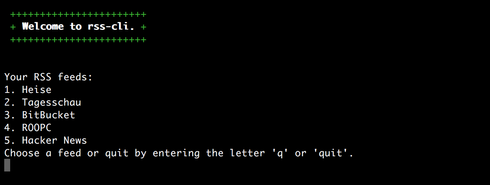

# rss-cli
Yet another command line interface for RSS. This one will open RSS feed items in Safari on your Mac.

# Usage
In order to start reading, you should run the following on a OS X machine

`ruby ./lib/reader.rb read`

This will create a _.rss_reader_config.yml_ in your home folder in case there is none already. You can add/edit feeds in that config file.

